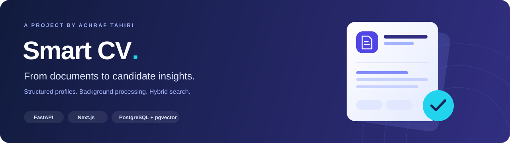
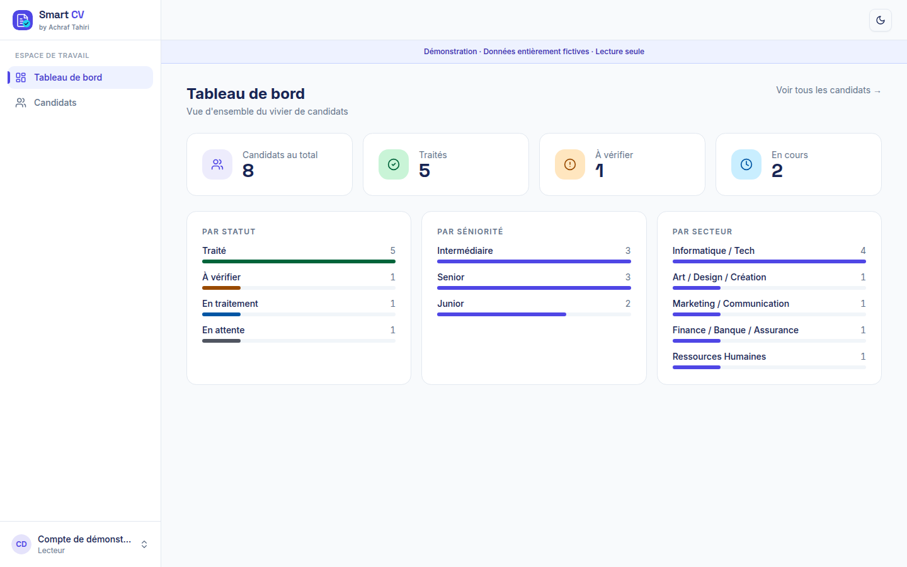
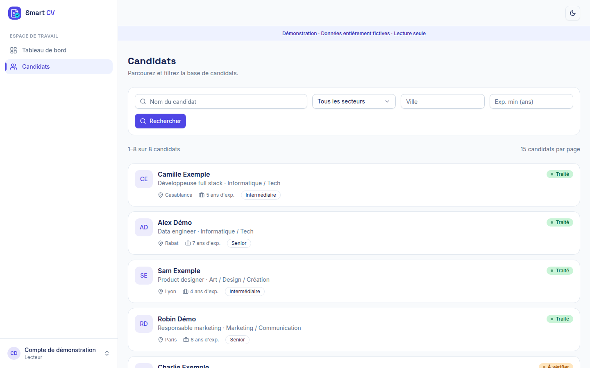
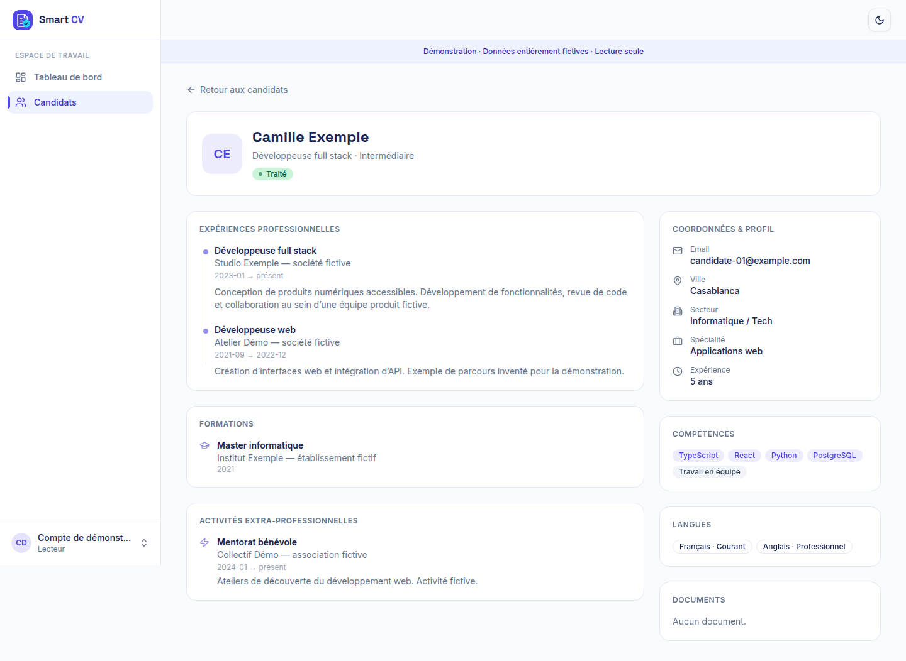
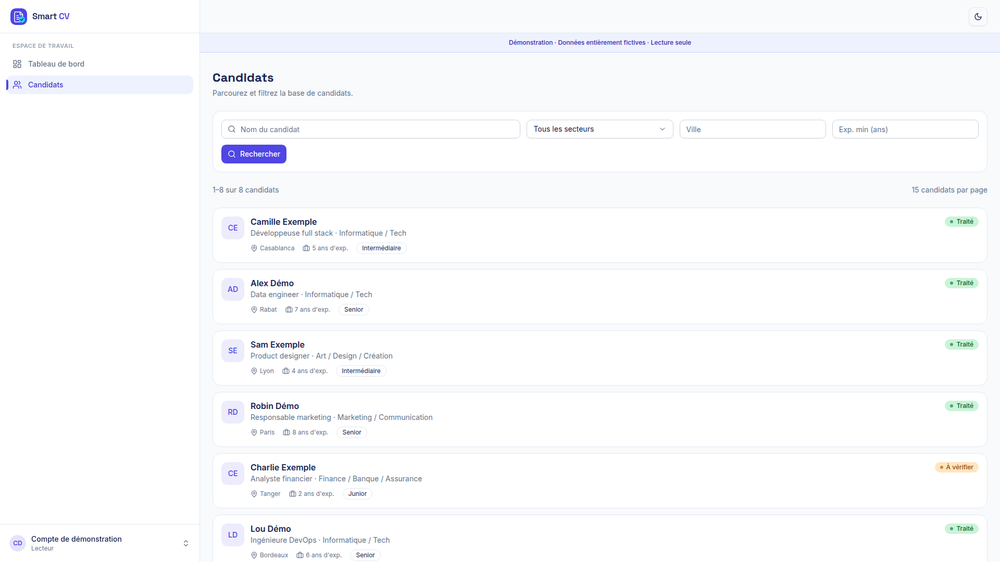
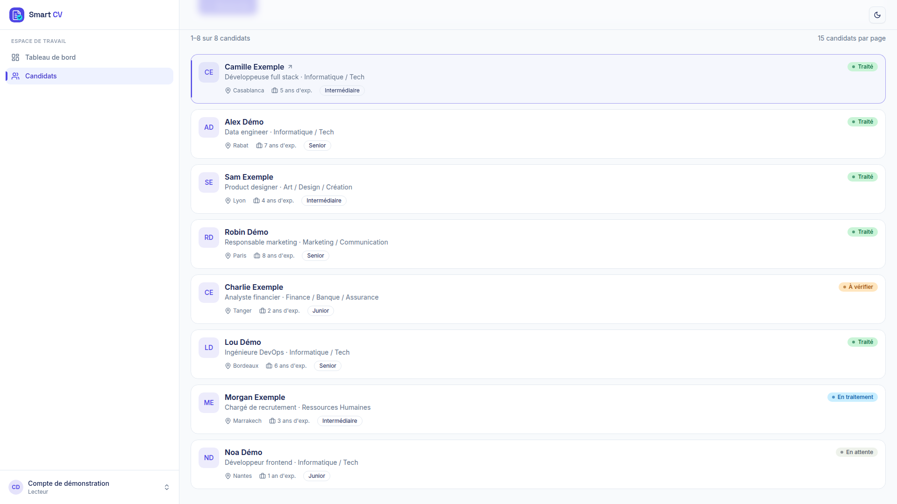
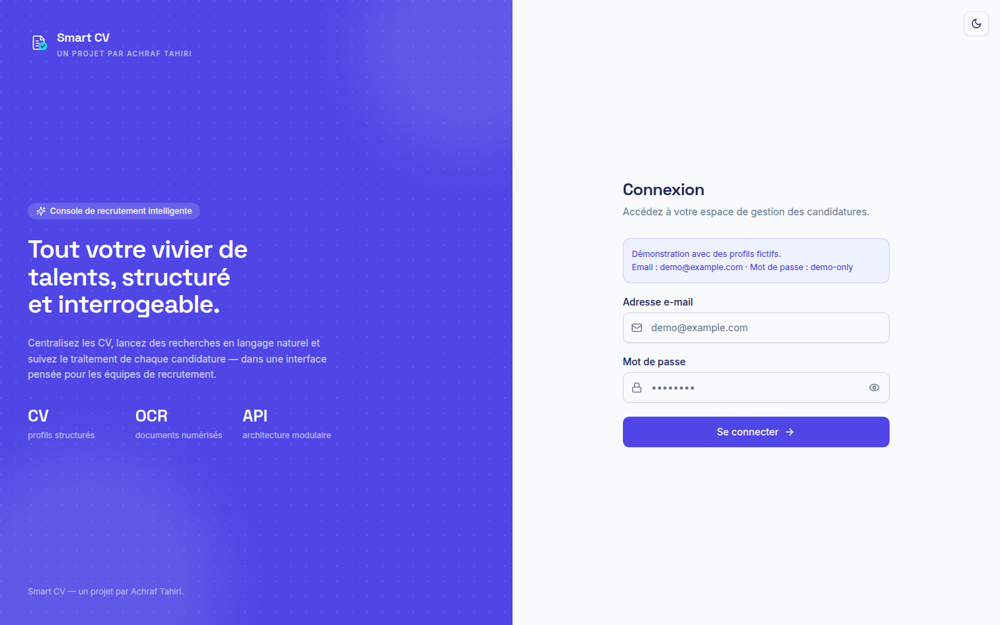
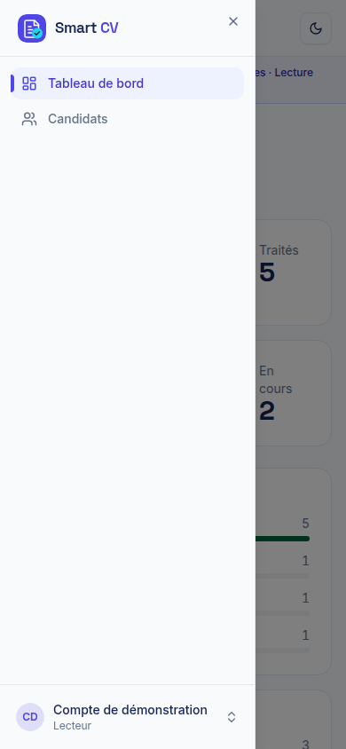
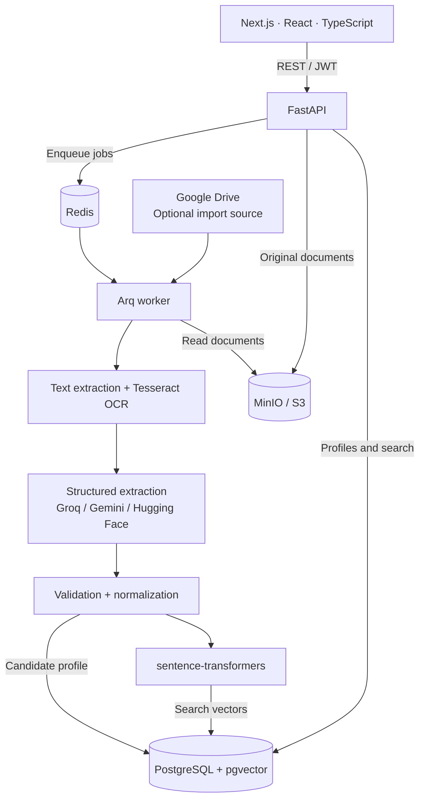

<p align="center">
  
</p>

# Smart CV

**A recruitment workspace that turns CV documents into structured, searchable profiles.**

[](https://github.com/Achraf-Tahiri/Smart-CV/actions/workflows/ci.yml)
[](LICENSE)




[Screenshots](#screenshots) · [Try the preview](#try-the-preview) · [Architecture](#architecture) · [Run the full application](#run-the-full-application) · [Development guide](docs/DEVELOPMENT.md)

## What it does

Smart CV brings document ingestion, candidate management, and search into one workspace.
Upload a CV, follow its background processing, review the extracted profile, and find
candidates using structured filters or hybrid text and vector search.

| Workflow | Implementation |
| --- | --- |
| **Collect** | PDF, DOCX, and image uploads; content-hash deduplication; MinIO document storage |
| **Process** | Redis/Arq background jobs, French and English OCR, structured extraction with provider fallback |
| **Organize** | Candidate profiles with experience, education, skills, languages, and processing status |
| **Find** | Name and attribute filters, PostgreSQL full-text search, pgvector similarity, natural-language API search |
| **Manage** | Role-based access, rotating refresh tokens, audit logs, data export, optional retention, and Google Drive imports |

**Status:** working MVP under active development. The interface is currently in French.
The screenshots and preview below contain **only fictional candidates**. No real CVs or
candidate databases are included. See [demo data and repository hygiene](docs/PRIVACY.md).

## Screenshots

These are captures of the actual application interface, connected to the isolated,
read-only fixture server. Counts and profiles are synthetic, not production metrics.

### Workspace overview



### Search and profile review

| Candidate search | Structured profile |
| --- | --- |
|  |  |

### Responsive sidebar

The sidebar grows with the desktop viewport, and the account menu stays visible
at the bottom of the window while the candidate list scrolls. Results are paginated
at 15 candidates per page.



<details>
<summary>After scrolling the candidate list</summary>



</details>

<details>
<summary>Sign-in screen and mobile navigation</summary>





</details>

## Try the preview

Explore the interface without Docker, a database, provider keys, or real candidate data.
Requires **Node.js 24** and **pnpm 9**.

```bash
git clone https://github.com/Achraf-Tahiri/Smart-CV.git
cd Smart-CV/apps/web
pnpm install
pnpm preview:demo
```

Open **http://127.0.0.1:3105** and sign in with:

- Email: `demo@example.com`
- Password: `demo-only`

The preview is read-only and uses eight invented profiles. Upload, extraction, and
editing require the full application. Its fixture server binds to loopback and does
not access PostgreSQL, Redis, MinIO, Google Drive, or language-model providers.
[Preview details and screenshot reproduction →](apps/web/demo/README.md)

## Architecture



**Why this structure:** background jobs keep document processing outside the HTTP
request cycle. Provider interfaces isolate external services, while pure domain
functions handle dates, experience calculation, and normalization. PostgreSQL stores
both candidate records and search vectors, keeping retrieval in one database.

## Run the full application

Install Docker with the Compose plugin, then from the repository root:

```bash
cp .env.example .env
# Set your own JWT secret and database/storage credentials in .env.
docker compose build
docker compose up -d postgres redis minio
docker compose run --rm -T api uv run --frozen alembic upgrade head
docker compose run --rm -T api uv run --frozen \
  python -m app.scripts.create_admin \
  --email admin@example.com --password 'replace-with-a-strong-password'
docker compose up -d api worker web
```

| Service | Default address |
| --- | --- |
| Application | http://localhost:3000 |
| API documentation | http://localhost:8000/docs |
| MinIO console | http://localhost:9001 |

Add a supported provider key in `.env` for structured extraction. Without one,
processing falls back to manual review. For semantic search, set
`EMBEDDINGS_BACKEND=sentence-transformers`; the default deterministic backend is
for testing and does not provide semantic similarity. Model downloads are cached.

The first build includes OCR tools and CPU PyTorch and can take several minutes.
The Compose stack is a local development setup. [Configuration, migrations, and troubleshooting →](docs/DEVELOPMENT.md)

## Engineering and verification

- **Backend:** Python 3.12+, FastAPI, Pydantic v2, SQLAlchemy 2 async, Alembic.
- **Frontend:** Next.js 15, React 19, TypeScript, Tailwind CSS, shadcn/ui, Radix UI.
- **Tests:** pytest, Vitest, Testing Library, and Playwright.
- **CI:** public-file guard, backend lint/format/tests with OCR dependencies, frontend tests and build.

```bash
# From the repository root, after building the API image:
docker compose run --rm -T api uv run --frozen pytest
python3 scripts/check_public_repo.py

# From apps/web:
pnpm test
pnpm build
```

Backend integration tests use a separate test database. Screenshot checks exercise
login, search, profile navigation, read-only permissions, and mobile layout against
the synthetic preview. [Detailed test commands →](docs/DEVELOPMENT.md#development-and-verification)

## Repository map

```text
apps/api/src/app/    Routes, domain logic, providers, services, and worker
apps/api/tests/      Synthetic unit and integration fixtures
apps/api/alembic/    Database migrations
apps/web/src/        Pages, components, and typed API client
apps/web/demo/       Fictional profiles for the isolated preview
apps/web/scripts/    Preview server and screenshot capture
docs/               Setup guide, privacy notes, and screenshots
infra/postgres/     pgvector initialization
scripts/            Public-repository guard
```

## Roadmap

- Expand end-to-end coverage for uploads and candidate editing.
- Improve bulk import controls and background-job visibility.
- Add an English application interface.
- Document deployment and extend performance and production-hardening checks.

## License

Licensed under the [MIT License](LICENSE). Copyright © 2026 Achraf Tahiri.

Third-party components retain their own licenses. See [third-party notices](THIRD_PARTY_NOTICES.md)
for the UI components adapted from shadcn/ui; dependencies and external services
remain subject to their respective license terms.
